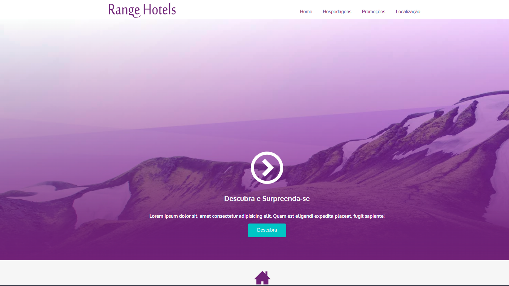

Angels Hostels is a project where I started implementing responsiveness for multiple screen sizes using HTML and CSS. The goal was to ensure a smooth and adaptable layout across desktops, tablets, and mobile devices. This project marked the beginning of my exploration into flexible web design, improving my skills in structuring pages for a better user experience on different devices.

**[See Page](https://luigineryproject8.netlify.app)** 

